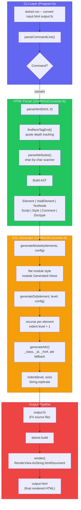
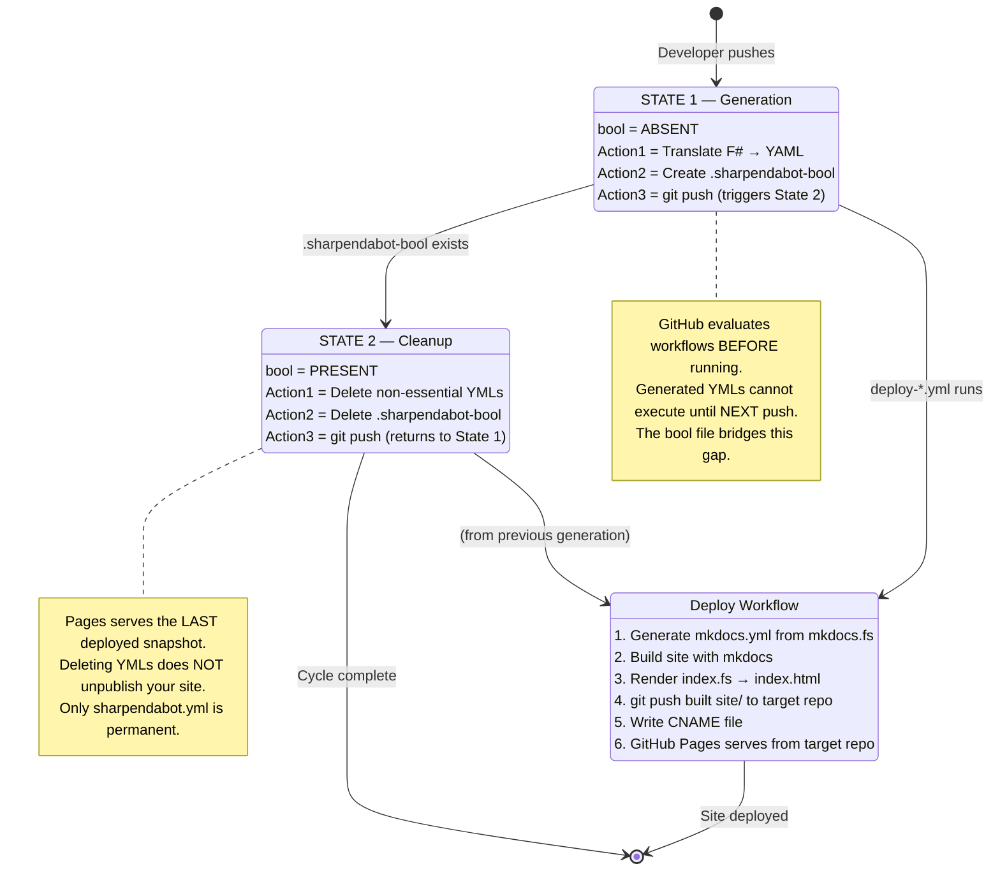
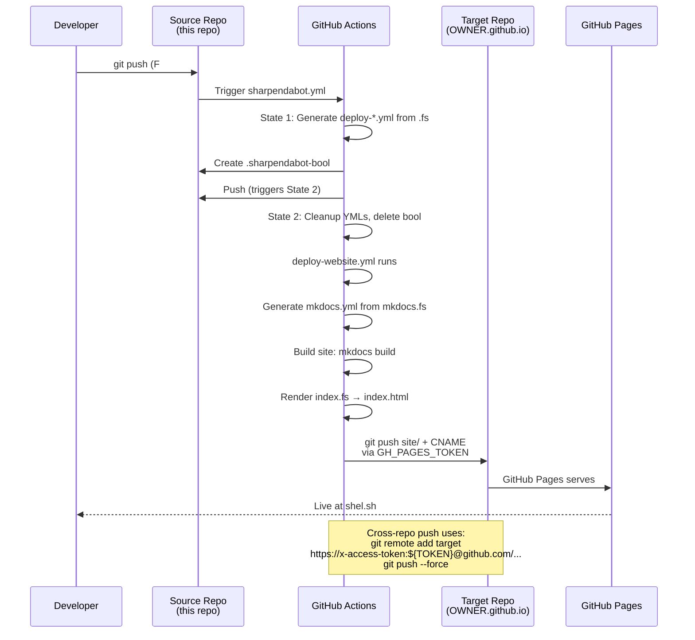

# Repository Architecture

## Overview

This repository uses a **multi-subdomain, cross-repo deployment** architecture with F#-first configuration.

Each site folder (`main/`, `docs/`, `app/`, `blog/`) builds locally and pushes its output to an entirely separate GitHub repository using token-authenticated git.

```
┌─────────────────────────────────────────────────────────────────────────────┐
│                           GitHub Repository (main branch)                    │
│                                                                              │
│  ┌─────────────────────────────────────────────────────────────────────┐   │
│  │  Root (repo/) - Documentation & Source Code                          │   │
│  │  ├── README.md, ARCHITECTURE.md                                      │   │
│  │  ├── documentation/ - Project docs (not deployed)                    │   │
│  │  ├── src/ - F# source code                                           │   │
│  │  │   ├── shared/Components.fs - Shared components                    │   │
│  │  │   ├── generator/ - HTML converter and tokenization tools           │   │
│  │  │   │   ├──GiraffeDslConverter.fs - main /throw/ engine              │   │
│  │  │   │   ├──SafeStringBuilder.fs - HTML/JS/CSS embedding handler      │   │
│  │  │   │   ├──XmlStyleLiteral.fs - """foo"""                            │   │
│  │  │   │   ├──EnhancedConverter.fs - XML-walking super mech             │   │
│  │  │   │   └──DelimiterExtractor.fs - tokenization library              │   │
│  │  │   └── html2giraffe/ - Core library                                │   │
│  │  └── GenerateConfig.fsx - Config generator (yml engine)             │   │
│  └─────────────────────────────────────────────────────────────────────┘   │
│                                                                              │
│  ┌─────────────┐  ┌─────────────┐  ┌─────────────┐  ┌─────────────────┐   │
│  │   main/     │  │   docs/     │  │    app/     │  │     blog/       │   │
│  │             │  │             │  │             │  │                 │   │
│  │  mkdocs.fs  │  │  mkdocs.fs  │  │  mkdocs.fs  │  │    mkdocs.fs    │   │
│  │  docs/      │  │  docs/      │  │  docs/      │  │    docs/        │   │
│  │  └── *.md   │  │  └── *.md   │  │  └── *.md   │  │    └── *.md     │   │
│  └──────┬──────┘  └──────┬──────┘  └──────┬──────┘  └────────┬────────┘   │
│         │                │                │                  │            │
│         ▼                ▼                ▼                  ▼            │
│    ┌─────────┐      ┌─────────┐      ┌─────────────┐    ┌────────┐       │
│    │ website │      │  docs   │      │applications │    │  blog  │       │
│    │ branch  │      │ branch  │      │   branch    │    │ branch │       │
│    └────┬────┘      └────┬────┘      └─────┬───────┘    └───┬────┘       │
└─────────┼────────────────┼─────────────────┼────────────────┼────────────┘
          │                │                 │                │
          ▼                ▼                 ▼                ▼
    ┌──────────┐     ┌──────────┐     ┌──────────────┐  ┌──────────┐
    │shel.sh   │     │docs.shel │     │  app.shel.sh │  │blog.shel │
    │          │     │   .sh    │     │              │  │   .sh    │
     │          │     │          │     │              │  │          │
    └──────────┘     └──────────┘     └──────────────┘  └──────────┘
```

## Overview of all scripts:
[/workflows-in-fsharp/](https://github.com/CommanderTurtle/fsharp-material/tree/main/documentation/workflows-in-fsharp) contains all "workflow-only" scripts not listed below

```
│   └── generator/                     # HTML converter and tokenization tools
│       ├── Generator.fsproj           # #
│       ├── GiraffeDslConverter.fs     # main /throw/ engine & full DSL converter
│       ├── SafeStringBuilder.fs       # HTML/JS/CSS embedding handler with triple-quote handling
│       ├── DelimiterExtractor.fs      # Section extraction and tokenization library
│       ├── XmlStyleLiteral.fs         # XML-style literals """hi there"""
│       ├── EnhancedConverter.fs       # High-level API (XML-walking super mech)
│       ├── DomRepresentation.fs       # Typed DOM
│       ├── HtmlToGiraffe.fs           # HAP-based converter
│       ├── Verification.fs            # Roundtrip + orphan check
│       └── Program.fs                 # CLI entry point (deploy command)
```

```
│   ├── html2giraffe/                  # Core library (PRESERVED)
│   │   ├── Html2Giraffe.fsproj        # #
│   │   ├── Ast.fs                     # Abstract Syntax Tree (AST) types for HTML representation
│   │   ├── Parser.fs                  # Utilization of Anglesharp lib to parse whitespace, text, comments (differentiation)
│   │   ├── Attributes.fs              # Define all html attributes <foo></bar>
│   │   ├── Converter.fs               # Raw text encoding & depth mapping library
│   │   ├── Roundtrip.fs               # Roundtrip convert strings & test the HTML DOM (error check)
│   │   └── Library.fs                 # API for Html2Giraffe library (defines callable functions for all test/validate modules)
```

## Folder Structure

### Root (`repo/`)
- **Purpose**: Documentation and source code (not deployed)
- **Contains**: README, architecture docs, F# source, config generator

### `main/` → `shel.sh` (website branch)
```
main/                             # input
├── mkdocs.fs                     # F# config source
├── pyproject.fs
├── docs/
│   └── indexmd.fs/index.fs       # F# site content source -> index.md or index.html

main/                             # output
├── mkdocs.yml                    # Generated (gitignored)
├── pyproject.toml
├── docs/
│   └── index.md/index.html       # index.md or index.html any mkdocs compatible page

Technically, one could name a file sharpmd-README.fs -> and it would become README.md .. if preferring the README namescheme.
Root dependencies are defined in `pyproject.fs` → generates `pyproject.toml`.
```

---
The next few are just examples of the architecture:
### `docs/` → `docs.shel.sh` (docs branch)
```
docs/
├── mkdocs.fs          # F# config source
├── docs/
│   └── index.md       # Main docs
└── mkdocs.yml         # Generated (gitignored)
```

### `app/` → `app.shel.sh` (applications branch)
```
app/
├── mkdocs.fs          # F# config source
├── docs/
│   └── index.md       # App dashboard
└── mkdocs.yml         # Generated (gitignored)
```

### `blog/` → `blog.shel.sh` (blog branch)
```
blog/
├── mkdocs.fs          # F# config source
├── docs/
│   └── index.md       # Blog posts
└── mkdocs.yml         # Generated (gitignored)
```

## Deployment Mapping

| Folder | Branch | Domain | Workflow |
|--------|--------|--------|----------|
| `main/` | `website` | `shel.sh` | `deploy-website.yml` |
| `docs/` | `docs` | `docs.shel.sh` | `deploy-docs.yml` |
| `app/` | `applications` | `app.shel.sh` | `deploy-app.yml` |
| `blog/` | `blog` | `blog.shel.sh` | `deploy-blog.yml` |

## F#-First Configuration

Each subdomain has its own `mkdocs.fs`:

```fsharp
module Main.MkDocs  // or Docs.MkDocs, App.MkDocs, Blog.MkDocs

let content = """
site_name: shel.sh
site_url: https://shel.sh
nav:
  - Home: index.md
"""

let render() = content
```

### Generate Configs

```bash
# Generate all
dotnet fsi GenerateConfig.fsx all

# Generate specific
dotnet fsi GenerateConfig.fsx main
dotnet fsi GenerateConfig.fsx docs
dotnet fsi GenerateConfig.fsx app
dotnet fsi GenerateConfig.fsx blog
```

## Shared Components

Common F# modules are in `src/shared/`:

```fsharp
// src/shared/Components.fs
module Shared.Components

open Giraffe.ViewEngine

let card (body: string) =
    div [ _class "card" ] [ rawText body ]
    |> RenderView.AsString.htmlNode
```

The current exemplary `Components.fs` has significantly expanded. The full API now includes:
- `admonition`, `card`, `featureGrid`, `button`, `badge` (see [#complete-newbie-pattern](https://github.com/CommanderTurtle/fsharp-material/#complete-newbie-pattern))
- `hero` (title/subtitle/CTA hero section)
- `codeBlockWithCopy` (code blocks with copy-to-clipboard)
- `tabContainer` (tabbed content panels)
- `searchAndMatch`, `appendToMatching`, `walkTree` (AST utilities)
- `HtmlAst` module for programmatic HTML manipulation

## Workflow Triggers

Each workflow triggers only when its folder changes:

```yaml
on:
  push:
    branches: [ main ]
    paths:
      - 'main/**'   # Only trigger on main/ changes
```

This prevents unnecessary rebuilds when other subdomains change.

This pattern is used in all deploy workflows. Each site deploys independently when its own folder changes. The `deploy-website.fs` workflow watches `main/**`, `deploy-docs.fs` watches `docs/**`, etc.

## DNS Configuration

| Type | Host | Value |
|------|------|-------|
| A | `@` | `185.199.108.153` |
| A | `@` | `185.199.109.153` |
| A | `@` | `185.199.110.153` |
| A | `@` | `185.199.111.153` |
| CNAME | `www` | `shel.sh` |
| CNAME | `docs` | `username.github.io` |
| CNAME | `app` | `username.github.io` |
| CNAME | `blog` | `username.github.io` |
The A records are for the apex domain (shel.sh). The CNAME records for subdomains should point to the **GitHub Pages domain** for your username:

```
CNAME docs -> YOURUSERNAME.github.io
CNAME app  -> YOURUSERNAME.github.io
CNAME blog -> YOURUSERNAME.github.io
```

The deploy workflows automatically create a `CNAME` file in the target repo during deployment.
## Key Principles

1. **Lightweight** - Each subdomain folder only contains what's needed
2. **F#-first** - All configs are F# sources that generate YAML
3. **Shared modules** - Common code in `src/shared/`
4. **Independent deployments** - Each subdomain deploys separately
5. **Nothing but source files in site DIRs** - Deployments to repositories are sent from Github Actions artifacts.
	- Built sites live only in their target repos, never mixed with F# code.

---

# Giraffe DSL Converter - Further Examples

## What the New Engine Produces

The `GiraffeDslConverter` parses HTML element-by-element and generates **proper Giraffe ViewEngine DSL code**.

---

## Example 1: Simple HTML

### Input
```html
<div class="container">
    <h1>Hello World</h1>
    <p>Welcome to my site</p>
</div>
```

### Output (Proper Giraffe DSL)
```fsharp
namespace Generated

open Giraffe.ViewEngine

module Views =
    let page =
        div [ _class "container" ] [
            h1 [] [ str "Hello World" ]
            p [] [ str "Welcome to my site" ]
        ]
```

---

## Example 2: With Attributes

### Input
```html
<a href="/about" class="btn" id="main-link">About Us</a>
```

### Output
```fsharp
a [ _href "/about"; _class "btn"; _id "main-link" ] [ str "About Us" ]
```

---

## Example 3: Script with Complex Content

### Input
```html
<script>
    console.log("Hello \"World\"!");
    var path = "C:\Users\test";
    const regex = /"/g;
</script>
```

### Output
```fsharp
script [] [
    rawText """
    console.log("Hello "World"!");
    var path = "C:\Users\test";
    const regex = /"/g;
    """
]
```

**Note:** The script content uses triple-quoted strings - no escaping needed!

---

## Example 4: Complete Page

### Input
```html
<!DOCTYPE html>
<html>
<head>
    <title>My Page</title>
    <style>
        body { color: red; }
        .highlight { background: yellow; }
    </style>
</head>
<body>
    <nav>
        <a href="/">Home</a>
        <a href="/about">About</a>
    </nav>
    <main>
        <h1>Welcome</h1>
        <p class="highlight">This is highlighted</p>
    </main>
    <script>
        document.querySelector('h1').style.color = 'blue';
    </script>
</body>
</html>
```

### Output
```fsharp
namespace Generated

open Giraffe.ViewEngine

module Views =
    let page =
        html [] [
            head [] [
                title [] [ str "My Page" ]
                style [] [
                    rawText """
                    body { color: red; }
                    .highlight { background: yellow; }
                    """
                ]
            ]
            body [] [
                nav [] [
                    a [ _href "/" ] [ str "Home" ]
                    a [ _href "/about" ] [ str "About" ]
                ]
                main [] [
                    h1 [] [ str "Welcome" ]
                    p [ _class "highlight" ] [ str "This is highlighted" ]
                ]
                script [] [
                    rawText """
                    document.querySelector('h1').style.color = 'blue';
                    """
                ]
            ]
        ]
```

---

## Example 5: Void Elements

### Input
```html

<br>
<input type="text" name="username">
```

### Output

```fsharp
img [ _src "logo.png"; _alt "Logo" ]      // unary, no [] needed
br []
input [ _type "text"; attr "name" "username" ]   // unary
```

as opposed to:

```fsharp
img [ _src "logo.png"; _alt "Logo" ] []
br [] []
input [ _type "text"; _name "username" ] []
```

This is the more **correct Giraffe.ViewEngine** style for void elements (`img`, `br`, `input`, `meta`, `hr`, etc.). The `[]` was removed in development because void elements in Giraffe's DSL are unary functions -- they don't take a children list.

This set is defined in `GiraffeDslConverter.fs`:

```fsharp
let voidElements : Set<string> = 
    Set ["area"; "base"; "br"; "col"; "embed"; "hr"; "img"; "input"; 
         "link"; "meta"; "param"; "source"; "track"; "wbr"]
```

These elements are rendered as **unary functions** (no children argument) in the Giraffe DSL.

---

## Example 6: Lists and Tables

### Input
```html
<ul class="items">
    <li>Item 1</li>
    <li>Item 2</li>
    <li>Item 3</li>
</ul>

<table>
    <tr>
        <th>Name</th>
        <th>Value</th>
    </tr>
    <tr>
        <td>Test</td>
        <td>123</td>
    </tr>
</table>
```

### Output
```fsharp
ul [ _class "items" ] [
    li [] [ str "Item 1" ]
    li [] [ str "Item 2" ]
    li [] [ str "Item 3" ]
]

table [] [
    tr [] [
        th [] [ str "Name" ]
        th [] [ str "Value" ]
    ]
    tr [] [
        td [] [ str "Test" ]
        td [] [ str "123" ]
    ]
]
```

---

## Example 7: Forms

### Input
```html
<form action="/submit" method="POST">
    <label for="email">Email:</label>
    <input type="email" id="email" name="email" required>
    <button type="submit">Submit</button>
</form>
```

### Output
```fsharp
form [ attr "action" "/submit"; attr "method" "POST" ] [
    label [ attr "for" "email" ] [ str "Email:" ]
    input [ _type "email"; _id "email"; attr "name" "email"; attr "required" "" ]
```

as opposed to:

```fsharp
form [ _action "/submit"; _method "POST" ] [
	label [ _for "email" ] [ str "Email:" ]
	input [ _type "email"; _id "email"; _name "email" ] []
```

For Developers:

**The `generateAttr` function currently handles these shortcuts:**

| Attribute  | Generated               | Status                         |
| ---------- | ----------------------- | ------------------------------ |
| `class`    | `_class "..."`          | [✓]                            |
| `id`       | `_id "..."`             | [✓]                            |
| `href`     | `_href "..."`           | [✓]                            |
| `src`      | `_src "..."`            | [✓]                            |
| `alt`      | `_alt "..."`            | [✓]                            |
| `type`     | `_type "..."`           | [✓]                            |
| `lang`     | `_lang "..."`           | [✓]                            |
| `action`   | `attr "action" "..."`   | Works, but could use `_action` |
| `method`   | `attr "method" "..."`   | Works, but could use `_method` |
| `for`      | `attr "for" "..."`      | Works, but could use `_for`    |
| `name`     | `attr "name" "..."`     | Works, but could use `_name`   |
| `required` | `attr "required" ""`    | Correct (boolean attribute)    |
| `data-*`   | `attr "data-foo" "..."` | Correct                        |

**To add `_action`, `_method`, `_for`, `_name` shortcuts**, modify `generateAttr` in `GiraffeDslConverter.fs`:

```fsharp
let generateAttr (attr: HtmlAttribute) : string =
    match attr.Name.ToLower(), attr.Value with
    | "class", Some v -> sprintf "_class \"%s\"" (WebUtility.HtmlDecode v)
    | "id", Some v -> sprintf "_id \"%s\"" (WebUtility.HtmlDecode v)
    | "href", Some v -> sprintf "_href \"%s\"" (WebUtility.HtmlDecode v)
    | "src", Some v -> sprintf "_src \"%s\"" (WebUtility.HtmlDecode v)
    | "alt", Some v -> sprintf "_alt \"%s\"" (WebUtility.HtmlDecode v)
    | "type", Some v -> sprintf "_type \"%s\"" (WebUtility.HtmlDecode v)
    | "lang", Some v -> sprintf "_lang \"%s\"" (WebUtility.HtmlDecode v)
    // Adding shortcuts..
    | "action", Some v -> sprintf "_action \"%s\"" (WebUtility.HtmlDecode v)
    | "method", Some v -> sprintf "_method \"%s\"" (WebUtility.HtmlDecode v)
    | "for", Some v -> sprintf "_for \"%s\"" (WebUtility.HtmlDecode v)
    | "name", Some v -> sprintf "_name \"%s\"" (WebUtility.HtmlDecode v)
    | name, Some v -> sprintf "attr \"%s\" \"%s\"" name (WebUtility.HtmlDecode v)
    | name, None -> sprintf "attr \"%s\" \"\"" name
```

Before the move to a more modern .NET runtime, we attempted to use System.Web. Everything has moved to System.Net:

**From:** Original `GiraffeDslConverter.fs` (before, in development)
>
> `open System.Web`
> `HttpUtility.HtmlDecode`

**Amended:** `System.Web` is not available in .NET 8/10. The current file uses:

```fsharp
open System.Net  // not System.Web
// ...
WebUtility.HtmlDecode  // not HttpUtility.HtmlDecode
```

This is the correct cross-platform replacement. `System.Net.WebUtility` is available in all .NET versions and performs identical HTML entity decoding.

---

## Example 8: Complex JavaScript (Gambling Overlay)

### Input
```html
<script>
function GamblingAuth() {
    this.currentScreen = 0;
    this.screens = ['wheel', 'blackjack', 'password', 'login', 'race', 'dice', 'success'];
    
    this.spinWheel = function() {
        const time = Math.random() * 15;
        console.log("Spinning for " + time + "s");
        return time;
    };
    
    this.blackjackHit = function() {
        const card = Math.floor(Math.random() * 52);
        console.log("Drew card: " + card);
        return card;
    };
    
    this.selectHorse = function(horseId) {
        console.log("Selected horse: " + horseId);
        return horseId;
    };
}
</script>
```

### Output
```fsharp
script [] [
    rawText """
function GamblingAuth() {
    this.currentScreen = 0;
    this.screens = ['wheel', 'blackjack', 'password', 'login', 'race', 'dice', 'success'];
    
    this.spinWheel = function() {
        const time = Math.random() * 15;
        console.log("Spinning for " + time + "s");
        return time;
    };
    
    this.blackjackHit = function() {
        const card = Math.floor(Math.random() * 52);
        console.log("Drew card: " + card);
        return card;
    };
    
    this.selectHorse = function(horseId) {
        console.log("Selected horse: " + horseId);
        return horseId;
    };
}
    """
]
```

**This is the key improvement!** The complex JavaScript is preserved exactly as-is inside a triple-quoted string.

---

## Comparison: Old vs New

### Old Approach (HtmlToGiraffe.fs)

```fsharp
// Uses escapeString which causes escape-graveyard
script [] [
    rawText "function test() {\n  console.log(\"Hello\\\"World\\\"\");\n}"
]
//                    ^^^^ ^^^^^^^ ^^^^^
//                    Escaped quotes everywhere!
```

### New Approach (GiraffeDslConverter.fs)

```fsharp
// Uses triple-quoted strings - no escaping!
script [] [
    rawText """
function test() {
  console.log("Hello "World"");
}
    """
]
// Clean, readable, no escaping!
```

---

## How It Works

### Parsing Pipeline

The pipeline now includes a **quote-aware tag boundary finder**

```
HTML Input
    ↓
Quote-aware tag boundary detection (tracks " and ' depth)
    ↓
Parse Element-by-Element with proper attribute extraction
    ↓
Build AST (Element, VoidElement, TextNode, Script, Style, Comment, Doctype)
    ↓
Generate Giraffe DSL Code with flat module style:
    ↓
- Regular elements → div [] [], span [] [], etc.
- Text nodes → str "content"
- Scripts/Styles → rawText """...""" (triple-quoted)
    ↓
Output: Proper F# Giraffe ViewEngine Code
```

### Key Features

1. **Element-by-element parsing** - No giant literal blocks
2. **Proper Giraffe DSL structure** - `div [] []`, `span [] []`, etc.
3. **Triple-quoted strings for scripts/styles** - No escaping hell
4. **Preserves formatting** - Newlines in scripts are preserved
5. **Handles any content** - Quotes, backslashes, regex all work

The quote-aware parser correctly handles:
- `x-show="open && items.length > 0"` (Alpine.js)
- `x-bind:class="open ? 'active' : 'inactive'"` (nested quotes)
- Any attribute containing `>` inside quoted values

---

## Usage

```bash
# Convert using proper Giraffe DSL (default)
html2giraffe convert input.html output.fs

# Convert using triple-quoted literal mode
html2giraffe convert --literal input.html output.fs

# Convert using line-by-line variable mode
html2giraffe convert --lines input.html output.fs

# Batch convert
html2giraffe batch input-dir output-dir
```

---

## Summary

| Feature | Old Engine | New Engine |
|---------------|------------|------------|
| **Structure** | Mixed literal/DSL | Proper Giraffe DSL |
| **Text escaping** | `\"` `\\` | None (triple-quoted) |
| **Script handling** | Often broken | Works perfectly |
| **CSS handling** | Escaped mess | Clean triple-quoted |
| **Readability** | Poor | Excellent |
| **Giraffe DSL purity** | Mixed | Pure (with rawText for scripts) |

The new engine produces **proper Giraffe ViewEngine DSL code** that follows F# conventions and handles any HTML content safely.

---

# Enhanced Engine Tools

## Overview

The enhanced engine uses F#'s triple-quoted strings to safely embed arbitrary HTML/JS/CSS without escaping issues. Inspired by the [TurtleProtect XML project](http://turtleprotect.org/projects/XML), it implements CMD-style tokenization and substring operations in a type-safe manner.

## Key Features

### 1. Triple-Quoted String Safety

```fsharp
// F# triple-quoted strings do NOT interpret:
// - {} \ < > % ! ^ or any other characters
// - No escaping required for HTML/XML/JS/CSS
// - Only """ ends the string

let safeHtml = """
<div class="test">
    <script>alert("Hello! %^<weird>");</script>
</div>
"""
```

### 2. CMD-Style Operations in F#

| CMD | F# Equivalent |
|-----|---------------|
| `%var:~1,5%` | `slice content 1 5` |
| `%var:~1%` | `sliceToEnd content 1` |
| `%var:old=new%` | `replace old new` |
| `FOR /F "tokens=*"` | `tokenizeLine line [" "]` |

### 3. XML-Style Literal Modules

```fsharp
module MyPage

let line0 = """<!DOCTYPE html>"""
let line1 = """<html>"""
let line2 = """<body>"""
// ... each line as a variable

let lines = [|
    line0
    line1
    line2
|]

let render() =
    line0 + "\n" + line1 + "\n" + line2

// CMD-style access
let getLine (index: int) = lines.[index]
let getRange (start: int) (count: int) = ...
let getSlice (start: int) (finish: int) = ...
```

## Module Reference

### SafeStringBuilder

Builds F# strings safely using triple-quoted literals.

```fsharp
// Wrap content in triple quotes
let escaped = SafeStringBuilder.toTripleQuoted html

// Create line-by-line variables
let lines = SafeStringBuilder.toLineVariables html "line"

// Build concatenation
let concat = SafeStringBuilder.buildConcatenation "line" 100

// Create complete module
let moduleCode = SafeStringBuilder.toLineModule html "MyModule" "line"
```

### DelimiterExtractor

Extracts sections from HTML using delimiters.

```fsharp
// Extract JavaScript sections
let scripts = DelimiterExtractor.extractJavaScript html

// Extract CSS sections
let styles = DelimiterExtractor.extractCSS html

// CMD-style slicing
let substring = DelimiterExtractor.slice content 10 50
let toEnd = DelimiterExtractor.sliceToEnd content 10

// Tokenize by delimiter
let tokens = DelimiterExtractor.tokenize content ","

// Line indexing
let indexed = DelimiterExtractor.toIndexedArray content
```

### XmlStyleLiteral

XML-project style literal handling.

```fsharp
// CMD-style tokenization
let tokens = XmlStyleLiteral.tokenizeLine line [" "; "\t"]

// CMD-style substring
let sub = XmlStyleLiteral.cmdSubstring content 10 (Some 50)

// Extract XML tags
let body = XmlStyleLiteral.extractTag html "body"

// Extract attributes
let classAttr = XmlStyleLiteral.extractAttribute tag "class"

// Create literal module
let code = XmlStyleLiteral.toLiteralModule html "MyModule"
```

### EnhancedConverter

Main conversion engine.

```fsharp
// Quick convert
let fsharpCode = EnhancedConverter.convertQuick html

// Convert with options
let options = {
    UseLineVariables = true
    VariablePrefix = "line"
    ModuleName = "MyPage"
    SeparateScripts = true
    UseInterpolation = false
}
let fsharpCode = EnhancedConverter.convert html options

// Validate output
match EnhancedConverter.validate fsharpCode with
| Ok () -> printfn "Valid!"
| Error errs -> printfn "Errors: %A" errs
```

## Usage Examples

### Basic Conversion

```bash
# Convert HTML to F#
dotnet run --project src/generator -- convert input.html output.fs

# The output uses triple-quoted strings:
# let content = """<html>...</html>"""
```

### Line-by-Line Mode

```bash
# For very large files, use line-by-line mode
dotnet run --project src/generator -- convert --lines input.html output.fs

# Output:
# let line0 = """<!DOCTYPE html>"""
# let line1 = """<html>"""
# ...
# let render() = line0 + "\n" + line1 + ...
```

### With Script Extraction

```bash
# Extract JS/CSS into separate variables
dotnet run --project src/generator -- convert --extract-scripts input.html output.fs

# Output:
# let headContent = """<head>...</head>"""
# let scriptContent = """<script>...</script>"""
# let styleContent = """<style>...</style>"""
# let bodyContent = """<body>...</body>"""
```

## Comparison: CMD vs F#

### String Safety

**CMD (breaks on special chars):**
```batch
set content=<div class="test">Hello %^!</div>
:: % and ^ cause issues!
```

**F# (handles everything):**
```fsharp
let content = """<div class="test">Hello %^!</div>"""
// No issues - everything is literal
```

### Substring Operations

**CMD:**
```batch
set result=%content:~1,5%
```

**F#:**
```fsharp
let result = DelimiterExtractor.slice content 1 5
```

### Line Processing

**CMD:**
```batch
for /f "tokens=*" %%a in (file.txt) do (
    set line=%%a
    echo [%line%]
)
```

**F#:**
```fsharp
File.ReadAllLines "file.txt"
|> Array.map (fun line -> $"[{line}]")
|> String.concat "\n"
```

## Advantages Over CMD

1. **No escaping hell** - Triple quotes don't interpret anything
2. **Type safety** - Compiler catches errors
3. **No metacharacter explosions** - `%`, `^`, `!` are just characters
4. **Deterministic slicing** - No weird edge cases
5. **Safe HTML/XML embedding** - No entity encoding needed
6. **Programmatic module generation** - Build code at runtime
7. **Mix static and dynamic** - Use interpolation only where needed

## How It Works

```
HTML Input
    ↓
Parse Components (head, body, scripts, styles)
    ↓
Extract Sections by Delimiters
    ↓
Convert to Triple-Quoted Strings
    ↓
Build F# Module with Line Variables
    ↓
Generate Render Function
    ↓
Output: Type-safe F# Code
```

## Testing

```bash
# Build the enhanced generator
dotnet build src/generator

# Test with sample HTML
dotnet run --project src/generator -- convert test.html test.fs

# Verify output compiles
dotnet fsi test.fs
```

## Integration with /throw/

The enhanced engine is used when processing HTML files from `/throw/`:

```bash
# Drop HTML in throw/
cp my-page.html throw/

# On push, workflow:
# 1. Converts HTML to F# using EnhancedConverter
# 2. Generates pages/my-page/index.fs
# 3. Renders to HTML for deployment
```

## Future Enhancements

- [ ] Interpolated strings for dynamic content
- [ ] Base64 embedding for binary assets
- [ ] Minification during conversion
- [ ] Source map generation
- [ ] Incremental conversion (only changed lines)

---

# Architecture Diagrams
## d-1. Full .NET Code Architecture:

This flowchart shows the call chain from the CLI entry point through HTML parsing, DSL generation, and rendering to the final HTML output.



## d-2. Workflow State Machine

This state diagram shows the Sharpendabot two-phase state machine, the role of the `bool` file, and the sequence from push through deployment.



# d-3. Cross-Repo Deployment Flow

This sequence diagram shows the full lifecycle from developer push to live site, including the cross-repo git push via token.



# Mathematical Evolution:

## m-1. Quote-Depth Tracking in the HTML Parser

The `findNextTagEnd` algorithm is a finite-state automaton that tracks quote nesting depth to correctly identify tag boundaries even when attribute values contain `>`. Formally:

Let the input string be a sequence of characters $`c_1, c_2, \ldots, c_n`$. Define the state machine $`\mathcal{M} = (Q, \Sigma, \delta, q_0, F)`$ where:

$`Q = \{ \text{OUTSIDE}, \text{IN\_DBL}, \text{IN\_SGL} \}`$

```math
\Sigma = \{ \texttt{`>'}, \texttt{`"'}, \texttt{`\\''}, \text{other} \}
```

The transition function $\delta : Q \times \Sigma \to Q$ is:

```math
\delta(q, c) =
\begin{cases}
\text{IN\_DBL} & \text{if } q = \text{OUTSIDE} \text{ and } c = \texttt{`"'} \\
\text{IN\_SGL} & \text{if } q = \text{OUTSIDE} \text{ and } c = \texttt{`\\'''} \\
\text{OUTSIDE} & \text{if } q = \text{IN\_DBL} \text{ and } c = \texttt{`"'} \\
\text{OUTSIDE} & \text{if } q = \text{IN\_SGL} \text{ and } c = \texttt{`\\'''} \\
q & \text{otherwise}
\end{cases}
```

A tag boundary at position $i$ is found when:

```math
`c_i = \texttt{`>'} \quad \land \quad q_{i-1} = \text{OUTSIDE}
```

This guarantees that any `>` appearing inside a quoted attribute value (e.g., `x-show="count > 0"`) is **not** misidentified as a tag terminator. The algorithm runs in $`O(n)`$ time with $`O(1)`$ space.

### Why This Matters

Consider the input:

```html
<div x-show="open && items.length > 0" class="active">
```

A naive parser using `IndexOf(">")` would find the `>` inside the attribute value, producing a malformed parse. With quote-depth tracking:

| Position | Char | State | Found? |
|----------|------|-------|--------|
| 0-4 | `<div ` | OUTSIDE | No |
| 5 | `"` | → IN_DBL | No |
| ... | `> 0"` | IN_DBL | **No** (inside quotes) |
| 39 | `>` | OUTSIDE | **Yes** (correct boundary) |

## m-2 The Sharpendabot State Machine as a Recurrence

Let $S_k \in \{0, 1\}$ denote the state at push $k$, where $0 = \text{State 1 (generate)}$ and $1 = \text{State 2 (cleanup)}$. Let $B_k \in \{\top, \bot\}$ be the existence of the `.sharpendabot-bool` file.

The system evolves according to:

$$B_k = \begin{cases} \bot & \text{if } k = 0 \text{ (initial)} \\ \top & \text{if } S_k = 0 \text{ (State 1 creates bool)} \\ \bot & \text{if } S_k = 1 \text{ (State 2 deletes bool)} \end{cases}$$

$$S_{k+1} = \begin{cases} 0 & \text{if } B_k = \bot \text{ (no bool → generate)} \\ 1 & \text{if } B_k = \top \text{ (bool exists → cleanup)} \end{cases}$$

Composing these gives the closed-form recurrence:

$$S_{k+1} = 1 - S_k \quad \text{with} \quad S_0 = 0$$

Which yields the alternating sequence:

$$S_k = k \bmod 2 = \{0, 1, 0, 1, 0, 1, \ldots\}$$

This proves that Sharpendabot is a **period-2 oscillator**: every even-numbered push triggers generation, every odd-numbered push triggers cleanup. The bool file is simply the memory element that stores the phase state between pushes.

## m-3 AST Node Cardinality

Let $T$ be an HTML document parsed into an abstract syntax tree. Define the node count function:

$$N(T) = \begin{cases}
1 & \text{if } T \in \{\text{TextNode}, \text{VoidElement}, \text{Doctype}\} \\
1 + \sum_{c \in \text{children}(T)} N(c) & \text{if } T = \text{Element}(\text{tag}, \text{attrs}, \text{children}) \\
1 + N(\text{content}) & \text{if } T \in \{\text{Script}, \text{Style}\}
\end{cases}$$

The DSL generator produces code with indentation depth proportional to tree depth:

$$\text{indent}(T, \ell) = \underbrace{\text{`    '}}_{\ell \text{ times}} \oplus \text{code}(T)$$

where $\ell$ is the level and $\oplus$ is string concatenation. For an HTML document of depth $d$, the total output size is $O(N(T) \cdot d)$.

## m-4 Triple-Quote Density

Let $s$ be a string of length $|s|$. Define the triple-quote density:

```math
\rho(s) = \frac{|\{i : s_i s_{i+1} s_{i+2} = \texttt{`"""'}\}|}{|s| - 2}
```

The engine's string safety guarantee: for any $\rho(s)$, the output is well-formed F# because:

```math
\text{output}(s) = \begin{cases}
\texttt{rawText ("""} s \texttt{""")} & \text{if } \rho(s) = 0 \\
\texttt{rawText (} \bigoplus_{i} \texttt{"""} p_i \texttt{"""} \texttt{)} & \text{if } \rho(s) > 0
\end{cases}
```

where $p_i$ are the parts of $s$ split on 
```math
\texttt{`"""'}
```
 and $\oplus$ is the `" + "` concatenation operator. This construction guarantees $\rho(p_i) = 0$ for all $i$ by definition, making the output always parseable.
